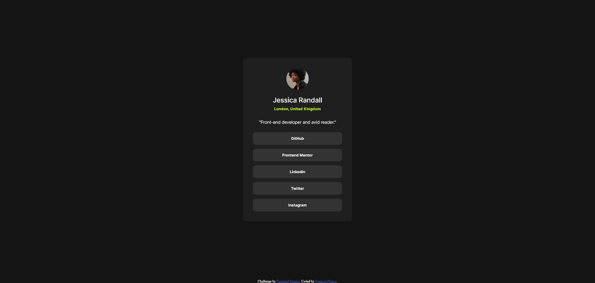

# Frontend Mentor - Social links profile solution

This is a solution to the [Social links profile challenge on Frontend Mentor](https://www.frontendmentor.io/challenges/social-links-profile-UG32l9m6dQ). Frontend Mentor challenges help you improve your coding skills by building realistic projects. 

## Table of contents

- [Overview](#overview)
  - [The challenge](#the-challenge)
  - [Screenshot](#screenshot)
  - [Links](#links)
- [My process](#my-process)
  - [Built with](#built-with)
  - [What I learned](#what-i-learned)
  - [Continued development](#continued-development)
  - [Useful resources](#useful-resources)
- [Author](#author)

## Overview

### The challenge

Users should be able to:

- See hover and focus states for all interactive elements on the page

### Screenshot

### Links

- Solution URL: https://github.com/splanco/social-links-profile
- Live Site URL: https://splanco.github.io/social-links-profile/

## My process

### Built with

- Semantic HTML5 markup
- CSS custom properties
- Flexbox

### What I learned

I think my main takeaway from this lesson was creating a generic CSS class that can be given to multiple elements that serve the same purpose. I also learned how to use the min(), max(), and clamp() functions to make my page more responsive.

### Continued development

I would like to continue to focus on increasing the responsiveness of my web pages. Utilizzing the resources given within native CSS is still somewhat confusing to me, so I think repeated use will allow me to gain some intuition on how they work.

### Useful resources

- [CSS min(), max(), and clamp()](https://web.dev/articles/min-max-clamp) - An easy to follow guide on the aformentioned functions with great examples.

## Author

- Website - [Github](https://github.com/splanco)
- Frontend Mentor - [@splanco](https://www.frontendmentor.io/profile/splanco)
